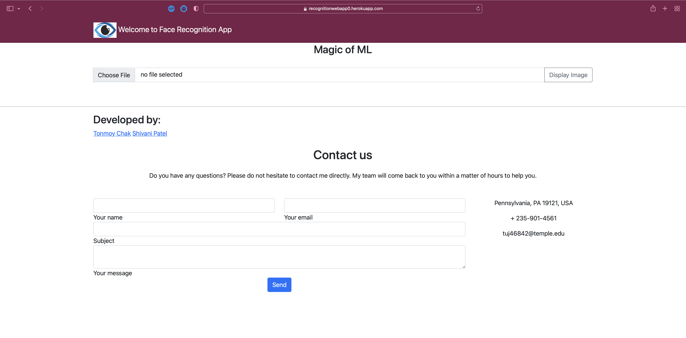
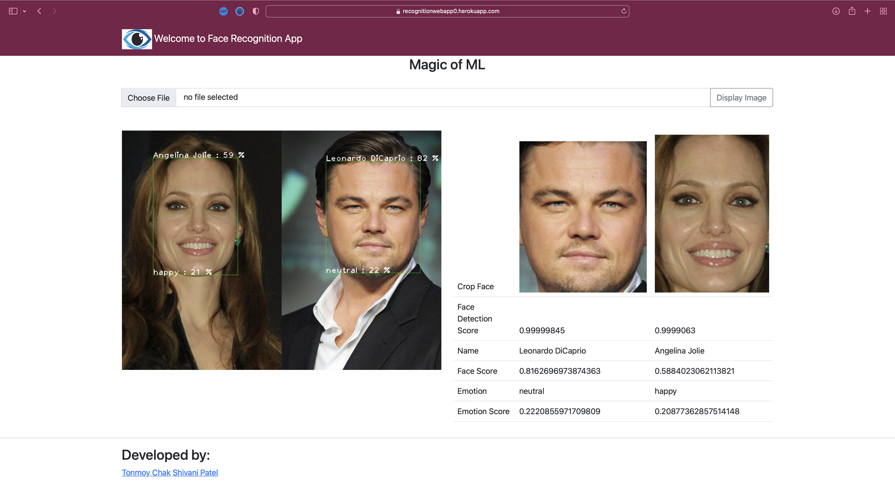
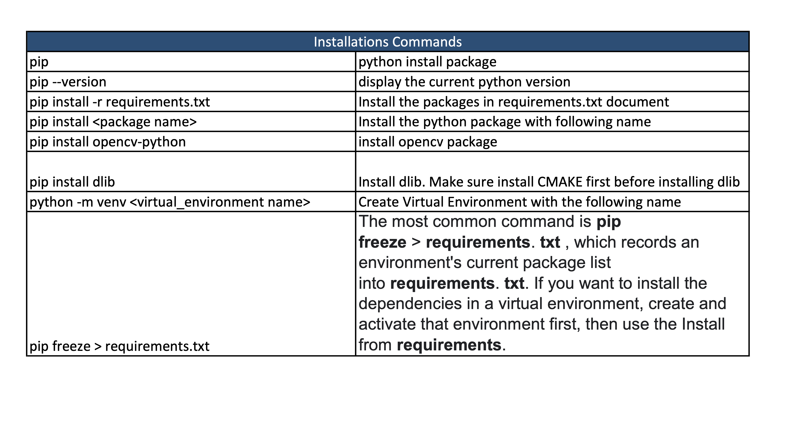

# Face-Recognition
Face Recognition is the way of identifying or confirming an individul's identity using their face. One of the common use of face recogniation is unlocking phone. Other uses are Airport and border control, Finding missing person, Improving retail, Banking, Marketing, Healthcare, Tracking, Gaming, Military and so on. We have decided to break the project into 5 phases such as Face detection and OpenCV, Develop face recognition model, Facial emotion recognination, Integrete face recogniation and deployment for web. 

Enjoy the App: https://recognitionwebapp0.herokuapp.com/

# About this Web App
Sensors Use:

RGB: color sensor (photo-electric sensor)

Depth: depth map analysis helps 

EEG: for measure of facial expression

Inertial: liveness detection for face authentication

# Project Board

To Do: helps to set what we want work on

In Progress: what is still in working

Done: is completed goal

# Sensing Pipeline Img

# Intsructions to run the app

# Versions 
asgiref==3.4.1
joblib==1.1.0
numpy==1.21.4
opencv-python-headless==4.5.4.60
Pillow==8.4.0
pytz==2021.3
scikit-learn==1.0.1
scipy==1.7.3
sklearn==0.0
sqlparse==0.4.2
threadpoolctl==3.0.0
